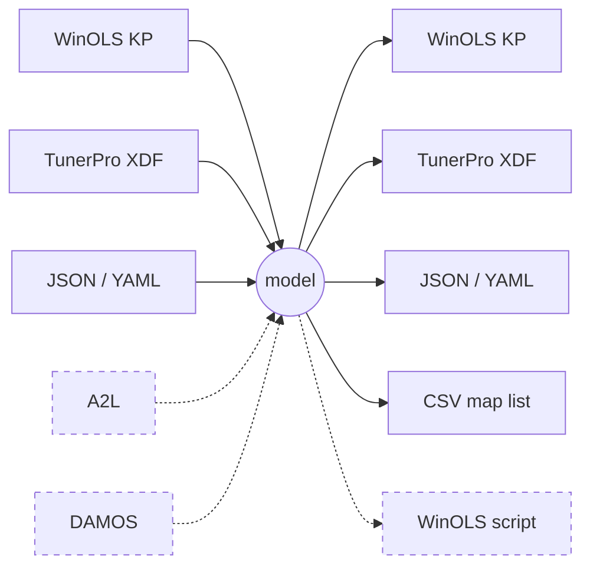
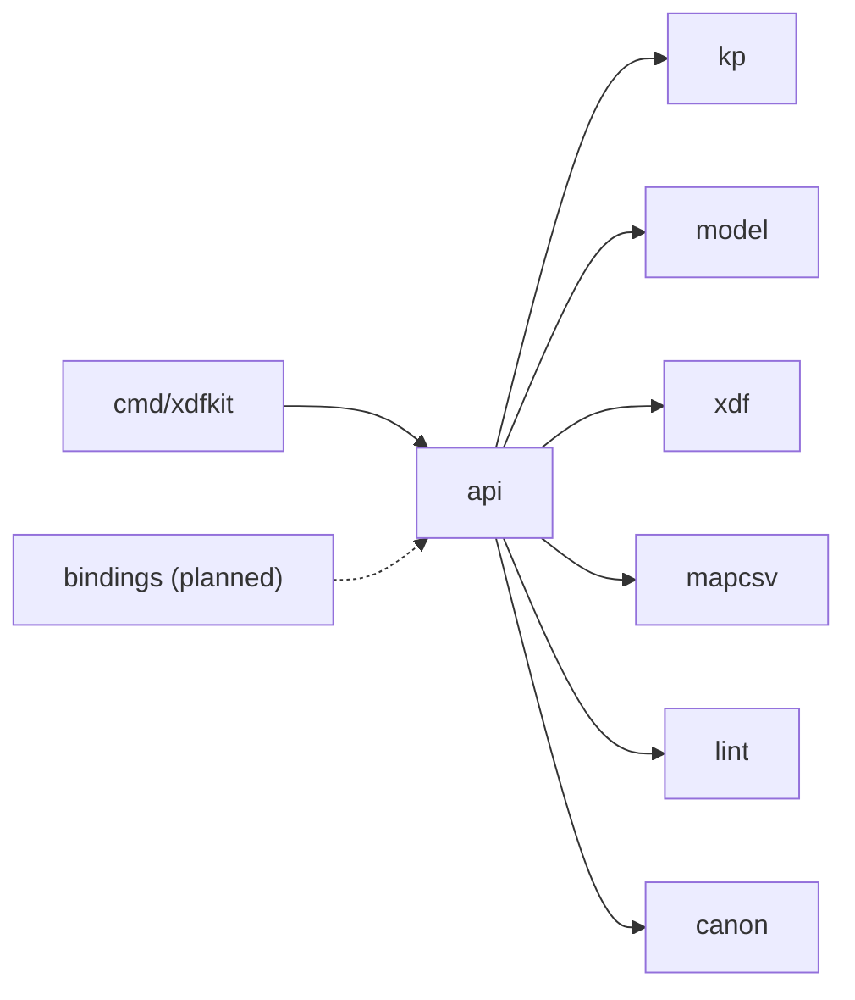
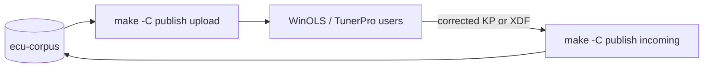

# xdfkit developer notes

The history of this repo is rewritten often: expect to `git reset --hard origin/master`. Nothing is a contract yet: the CLI, the `api` package, the model and its schema, file formats and the corpus layout can all change.

## Build and test

```sh
make            # lint (gofmt, go vet, staticcheck), test, build build/xdfkit
make help       # all targets
```

- `make lint` needs only Go and must pass before sending changes. `go.mod` has no toolchain directive; keep it that way.
- Tests use the archived ecuxplot packs and mapdump CSVs in `testdata/archive/ecuxplot/`, images from the private corpus, and jq 1.8. Without the corpus or jq those tests skip; `XDFKIT_REQUIRE_DATA=1` and `XDFKIT_REQUIRE_CORPUS=1` (as in CI) make them fail instead.
- The corpus is the private `ecu-corpus` repo (`docs/corpus.md`): a full clone at `../ecu-corpus` if present, else the `corpus/` submodule (`make corpus` fetches it, `make corpus-bump` moves it to the corpus head). `XDFKIT_CORPUS` overrides both.
- The lint rules also have synthetic fixtures (`testdata/lint/cases.json`) that run without the corpus.

## Formats

Every conversion goes through one model, so any input converts to any output. Dashed lines are planned: A2L and DAMOS input, WinOLS script output (the import route into WinOLS, `docs/winols-script.md`).



## Architecture



Core packages work on bytes, without file or console I/O, and use no cgo; the CLI does the I/O. Details: `docs/design.md`.

## Published definitions

The ecuxplot map packs are model JSON in ecu-corpus `defs/`. `publish/` generates every format from it and imports corrections made in WinOLS or TunerPro (`publish/README.md`).



## Rules

- Commit messages start with a prefix that `cliff.toml` groups: `feat`/`add`, `fix`, `docs`, `refactor`, `chore`, `ci`, `build`, `test`, `style`, `chore(deps)`.
- Never edit or regenerate `testdata/archive/ecuxplot/` (see its README).
- Private definition files (DAMOS, A2L, OLS) go only in the gitignored `testdata/local/`; never commit them.
- `docs/` describes how things are, including spec not implemented yet; plans are kept outside the repo.

## Releases

`make package` writes `dist/`. A tag `vX.Y.Z` publishes those archives as a GitHub release, with notes generated by git-cliff (`cliff.toml`); `vX.Y.Z-rcN` is a prerelease. Archives are `.tar.gz` for macOS and Linux and `.zip` for Windows, each with `xdfkit`, `README.md`, `COPYING` and `COPYING.LESSER`. `xdfkit version` prints the tag (`git describe`).

## Documentation

| Document | Covers |
| --- | --- |
| `docs/design.md` | Formats, implementation, architecture, CLI, verification |
| `docs/model.md` | The model and its JSON |
| `docs/format-matrix.md` | Which format supports which field |
| `docs/kp-format.md` | KP v1/v2 layout |
| `docs/autocorrect.md` | `lint` and `fix` |
| `docs/stamp-and-metadata.md` | Edit stamp and XDF metadata file |
| `docs/winols-script.md` | WinOLS script import format |
| `docs/corpus.md` | The shared image and definition corpus |
| `docs/naming.md` | File naming |
| `docs/integrations.md` | ecuxplot, ME7Sum, me7-logger |
