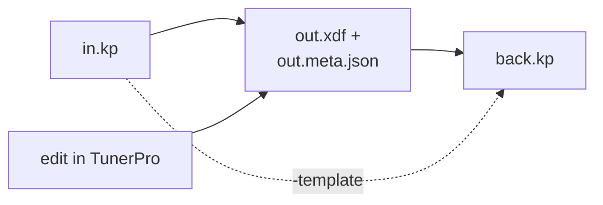
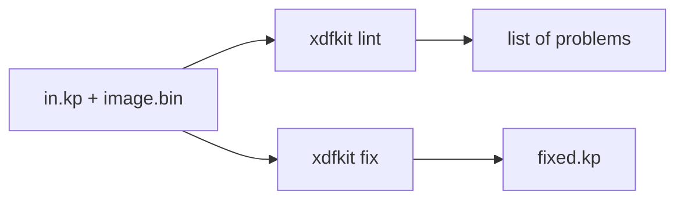

# xdfkit

A command-line converter between ECU map definition formats: WinOLS map packs (KP), TunerPro XDF, JSON and YAML. It also finds and fixes common axis mistakes in KP files by checking them against the flash image.

## Install

Download the archive for your system from the [releases page](https://github.com/nyetlabs/xdfkit/releases) and put `xdfkit` (`xdfkit.exe` on Windows) on your path. With Go installed:

```sh
go install go.nyet.org/xdfkit/cmd/xdfkit@latest
```

## Formats

| Format | Read | Write | Notes |
| --- | --- | --- | --- |
| WinOLS KP | yes | yes | Converts back unchanged |
| TunerPro XDF | yes | yes | Converts back unchanged with its `.meta.json` |
| JSON, YAML | yes | yes | Editable by hand; edits are detected |
| CSV map list | | yes | For spreadsheets |

## Usage

```sh
xdfkit -f xdf -i image.bin in.kp out.xdf    # KP to XDF, plus out.meta.json
xdfkit -template in.kp out.xdf back.kp      # XDF back to KP
xdfkit lint -i image.bin in.kp              # report axis mistakes
xdfkit fix -i image.bin -o fixed.kp in.kp   # fix them
xdfkit -f csv -i image.bin in.kp            # map list with value ranges
xdfkit in.kp out.json                       # KP to JSON (or out.yaml)
xdfkit verify out.json                      # has it been edited by hand?
```

The input format is detected from the file; the output format comes from `-f`, else the output file's extension. Existing files are not overwritten without `-force`. `xdfkit -h` lists every option.

### Converting back

Converting to another format and back gives the original definition. Keep `out.meta.json` next to `out.xdf`: it holds what XDF can't, and TunerPro ignores it. An XDF edited in TunerPro still converts back, and the edits are listed as warnings.



## Fixing KP files

`xdfkit lint` checks a KP file against the image it was made for and lists the problems. `xdfkit fix` writes a corrected copy, with only the fixes it is sure of.



It finds:

- Axes that show the wrong breakpoints in WinOLS. These are fixed.
- Axes whose values make no sense, usually a wrong address or size. These are only listed.
- Out-of-date map end addresses. These are fixed.

## Status

Under heavy development, aimed at a first usable release.

## Licence

LGPL-3.0-or-later. See `COPYING.LESSER` and `COPYING`. Developer notes: `DEVELOPER.md`.
