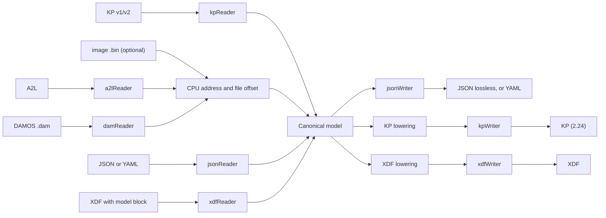

# Design: map definition converter (placeholder name xdfkit)

Converts map definitions between WinOLS KP, A2L, DAMOS, TunerPro XDF, WinOLS scripts and a lossless JSON/YAML model, and autocorrects KP files. Handoff entry point: `../AGENTS.md`. Related docs: `format-matrix.md`, `kp-format.md`, `autocorrect.md`, `stamp-and-metadata.md`, `xdf-embedding.md`, `winols-script.md`, `corpus.md`, `naming.md`, `integrations.md`.

## Decisions

- Outputs:
  - Canonical JSON: the first-class, lossless dump of the shared model, defined by a JSON Schema. This is the fidelity-preserving format and the reference for tests.
  - YAML: an alternate encoding of the same model with the same schema. It is a thin layer over the JSON model, with no YAML-only features (anchors, tags, multiple documents).
  - KP in the WinOLS 2.24 format (MVP, unless the feasibility gate fails): the only known lossless way into WinOLS, and the only writer that can be tested end to end, by trial imports into 2.24.
  - XDF (TunerPro XML 1.50, as written by `mapdump -x`): lossy, always written with a metadata sidecar (`name.meta.json`) holding everything XDF can't represent, so XDF plus sidecar is lossless. The comment-block embedding is optional. See `stamp-and-metadata.md`.
  - Edit stamp: every JSON output (model and sidecar) and every XDF carries SHA-256 digests of its canonical text (RFC 8785 and `jq -S .`; for XDF, of the JSON view its elements parse to), so readers can tell whether the data was hand edited after xdfkit wrote it. See `stamp-and-metadata.md`.
- Inputs: KP v1 (header codes 0x71/0x74) and KP v2 (0x124/0x149), exactly as ecuxplot's mapdump reads them (`org.nyet.mappack.Parser` in [ecuxplot](https://github.com/nyetlabs/ecuxplot)); A2L; DAMOS `.dam`; canonical JSON or YAML; XDF with an embedded model block.
- Users are assumed to have no licensed WinOLS options. Two ways into WinOLS remain:
  - KP files (lossless, but the format is undocumented).
  - WinOLS scripts: a documented text format (help topic "Importing with scripts", `HelpEn.chm`) that creates maps through `set_map_property`. Scripts are a core feature; the help mentions licences only for checksums and DAMOS. A script can only insert maps, not modify existing ones, so autocorrect still needs the KP patch writer. For converting A2L/DAMOS/XDF into WinOLS, the script writer replaces synthesized KP (stage 2) as the primary route.
- No A2L or DAMOS writers. In every WinOLS version checked (1.222 and 1.505 manuals, current product pages), DAMOS and A2L can only be imported, and only through the licensed Damos plugin (now OLS521, €785). The import is one-way, mostly limited to 1D/2D maps, and in EVC's words uses heuristics, so "the result isn't 100% safe".
- Separate repo, OS agnostic, command line first; other front ends (a standalone GUI app, other languages) go through the bindings below. Language: Go, decided 2026-10-07; pure (no cgo) for the core packages and the CLI, so the C library build is the only one that needs cgo.
- Bindings (decided 2026-10-07, not implemented yet): the converter is a library first, so any language or UI framework can use it.
  - Core packages work on bytes, never paths: no file or console I/O, no `os.Exit`, no mutable globals, safe for concurrent calls. `kp` and `canon` already follow this.
  - One façade package (`api/`) is the only surface the bindings use: named methods such as convert, lint, fix and verify, each taking input bytes plus a JSON request and returning output bytes plus a JSON response (findings, loss report, warnings) or a JSON error. Structured data crosses every boundary as canonical JSON, so a binding needs no per-type code. It recovers every panic into an error, so a bug never takes down a host process. Built now, ahead of new features, and the CLI is a client of it.
  - Surfaces over the façade: the CLI; a sidecar mode (`xdfkit rpc`, one JSON request and response per line on stdin/stdout) for front ends that run the binary; a C ABI shared library (`.dll`, `.so`, `.dylib` plus a header, built with `-buildmode=c-shared` from `capi/`, the only cgo code); and WebAssembly.
  - In `rpc` mode a file argument is either a path or base64 in the JSON; the C ABI and WebAssembly always pass bytes.
  - C ABI: one generic call, `xdfkit_call(method, request JSON, input bytes)`, returning output bytes and response JSON, plus a free function and an ABI version call. New methods never change the ABI. UTF-8 strings and byte buffers with explicit lengths; output allocated by the library and released with its free function; no Go pointers kept by the caller and no callbacks; the JSON documents carry their schema version.
  - The project ships the C header and the shared libraries only. Language wrappers (.NET P/Invoke, Python ctypes or cffi, Java JNA or the FFM API) live with the apps that use them.
  - Known limits of Go shared libraries: each library carries its own Go runtime (several MB), loading two Go-built shared libraries into one process is unreliable, and building for each OS needs that OS's C toolchain (native CI runners). One static binary per OS; `encoding/binary`, `encoding/json`, `archive/zip` and `compress/flate` are in the standard library, YAML through `gopkg.in/yaml.v3`. Because Go's deflate output differs from zlib's, v2 round trips are compared on the inflated map block, and a WinOLS load test must confirm that re-zipped files open.
- Licence: LGPL-3.0-or-later for the whole repo (decided 2026-10-07; `COPYING.LESSER`, with the GPL text it builds on in `COPYING`), so any program may link the shared library while changes to xdfkit itself stay copyleft. `kp/` is ported from ecuxplot's GPL-3.0 `org.nyet.mappack`, whose author relicenses the port. The corpus licence is separate and undecided.
- CLI naming: conversions are named `XXX2YYY` (input format, `2`, output format), for example `kp2json`, `json2kp`, `xdf2ols`. One binary serves them all: `xdfkit kp2json in out` works on every platform, and the binary also dispatches on its own name (ignoring a `.exe` suffix), so a link named `kp2json` behaves like `xdfkit kp2json`. On Unix, `xdfkit install-links DIR` creates the symlinks; the Windows release zip ships one-line `.cmd` shims (`@xdfkit kp2json %*`) instead, since Windows symlinks need extra privileges and zip files can't hold links. An `XXX2YYY` command rejects input that isn't format `XXX`. The plain form (`xdfkit [-f FMT] input [output]`, input format detected from the contents) stays. Decided 2026-10-07; not implemented yet.
- Project name: undecided. `xdfkit` is a placeholder for the proof of concept (Go module `go.nyet.org/xdfkit`, repo `github.com/nyetlabs/xdfkit`). Earlier drafts used `mapxlate`. Rename everywhere, including the XDF embedded-model marker, once a name is chosen.
- The WinOLS binaries are packed (VMProtect and repacked sections), and unpacking means defeating the copy protection, which this project won't do. KP decoding therefore relies on feature-sweep samples (KP files saved by WinOLS with one property changed at a time) plus the UI strings in `OLS_LangE.dll`, which is readable as shipped.
- KP v2 compression: the `intern` entry is raw deflate that zlib 1.2.x at level 9 reproduces exactly (see `kp-format.md`). Go's `compress/flate` produces a different, still valid, stream. Decision: pure Go, with the stage-1 round trip judged on the inflated block; a WinOLS load test confirms that re-deflated files open.

## Architecture

- `model`: one record per object. It holds every field in the capability matrix: id, description, comment, categories, address (file offset plus original CPU address and segment when known), element type/width/sign/endianness, bit mask, shape (value, 1D, 2D, nD, block, string), row/column-major order and record layout, conversion (linear, rational, formula, enum table), units, precision, display base, limits, difference/percent flags, search signatures, and axes (embedded, shared reference, fixed values, point count read from the image, stored as differences). Shared objects (axes, conversions, record layouts) are referenced by id, not inlined, so A2L structure survives.
- Per-source raw block: each object keeps a `source` section with the original format's fields that have no model field yet. For KP that means the unidentified header blocks, stored as hex. The KP writer uses it for byte-exact round trips. As fields get identified, they move from `source` into the model.
- `json` reader/writer: the JSON Schema is checked into the repo and validated in tests. Output is the canonical `jq -S .` form (sorted keys, 2-space indent; see `stamp-and-metadata.md`), so diffs stay readable. YAML reads and writes through the same model structs.
- `addrMap`: converts between CPU addresses and file offsets using MEMORY_SEGMENT plus the `.bin`, with a manual `--base` override, matching WinOLS's offset convention (the "-" and "+" offsets in its import dialog). Both addresses are kept in the model when known.
- Each writer has a lowering pass that reports, per object, what it dropped or approximated. The loss report goes to stderr, or to a file with `--report`.

## Repo layout

- `cmd/xdfkit/` CLI: `xdfkit [-i image.bin] [--base 0x...] [-f json|yaml|kp|xdf] [--report f] input.{kp,a2l,dam,json,yaml,xdf} [out]`, with input format detected from the file contents; `XXX2YYY` conversion commands (see Decisions, CLI naming); subcommands `xdfkit lint` and `xdfkit fix` (see Autocorrect)
- `internal/corpus`: test access to the `ecu-corpus` submodule (manifest lookups by name or SHA-256, skip or fail when absent).
- `api/` (the façade for all bindings), `capi/` (C ABI shared library, cgo), `model/` (with `schema.json`), `kp/`, `lint/`, `a2l/`, `dam/`, `json/` (YAML encoding lives here too), `addrmap/`, `xdf/`, `cmd/sampdiff/`
- `Makefile` (lint, test, build, package; version from git tags), `.github/` (build and release workflows, Dependabot), `cliff.toml` (release notes).
- `docs/`, `testdata/` (committed fixtures), `testdata/local/` (gitignored: private samples, never committed; tests that need them skip when absent), `corpus/` (the `ecu-corpus` git submodule, see `corpus.md`; not added yet)

## Verification

- KP to XDF matches current `mapdump -x -i bin` byte for byte for every KP and image pair in ecuxplot's `data/`.
- KP to JSON to KP: byte-identical for v1; identical inflated block and container fields for v2 (the stage 1 gate).
- Round trip: for every test input, input to JSON to model to JSON is identical, and JSON to YAML to JSON is identical. So is input to XDF (with embedded block) to model to JSON, including test strings containing `--`, `-->`, `<!--`, `]]>`, a trailing `-`, and non-ASCII. Notes are excluded from the comparison.
- XDF plus metadata sidecar to JSON equals the source JSON for every test input. Editing one table in the XDF flags exactly that object as edited.
- Stamps: every output verifies clean under both digests; `jq -S 'del(.stamp)' f.json | shasum -a 256` equals the `jq -S .` digest and the RFC 8785 transform of `jq -c 'del(.stamp)'` hashes to the `RFC8785` one; changing any value flags `edited`; reindenting or reordering object keys doesn't; respelling a number flags `mixed`.
- Feature-sweep samples: each variant's JSON differs from the base sample only in the field that was changed.
- WinOLS 2.24 (checked by hand in the GUI): synthesized KP imports cleanly, by trial and error until it does. XDF checked in TunerPro.
- A2L reader: checked against the ASAM spec and real A2L files with known values, not against WinOLS.
