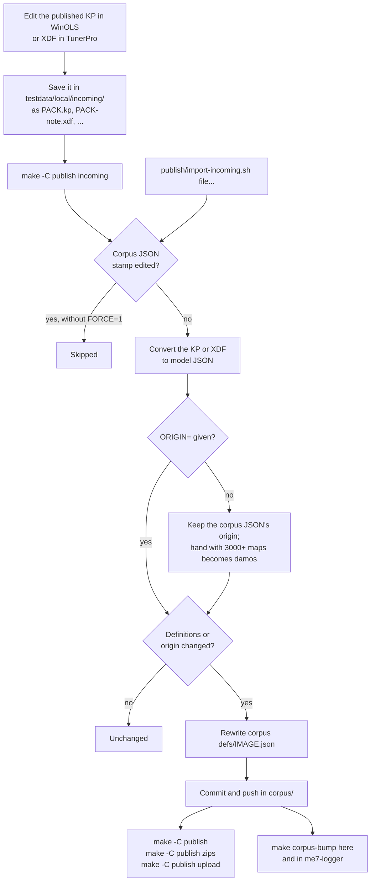

# Publishing map definitions

The published packs (KP, CSV map list, XDF with its metadata file, and dated zips) are generated from the model JSON in ecu-corpus `defs/IMAGE.json`. That JSON is the source of truth: a correction goes into it, never into the generated files. `make help` lists the targets; outputs go to `build/publish/`.

## Workflow

- PACK is the pack's stem in `testdata/archive/ecuxplot/images.tsv`; the file name starts with it, followed by `.` or `-`.
- An XDF needs its metadata file to keep what XDF can't hold: `NAME.meta.json` next to it, else `build/publish/PACK.meta.json`, which matches the published XDF.
- `make incoming` runs `import-incoming.sh` on every KP and XDF in `incoming/`; the script also takes files as arguments. Files from `incoming/` (and their metadata files) move to `incoming/imported/`, so a later run can't import them over newer work. One file per pack per run.
- The comparison ignores the stamp and the rest of the provenance. The origin is `damos`, `a2l` or `hand` (docs/corpus.md); set `ORIGIN=damos` for a smaller DAMOS export, `DAMOS_MAPS=` changes the cutoff, `FORCE=1` imports over a hand-edited corpus JSON.
- A pack's zip is dated by its JSON's last corpus commit, whatever the commit changed.

## Packs

`PACKS` in the Makefile lists the packs. A pack without corpus JSON is converted from its archived KP in `testdata/archive/ecuxplot/`: 8N0906018CB, whose pack fits only the archive's non-OEM image. The archive is never edited, so that pack can't be corrected through `incoming` until an OEM image of its software is in the corpus.
