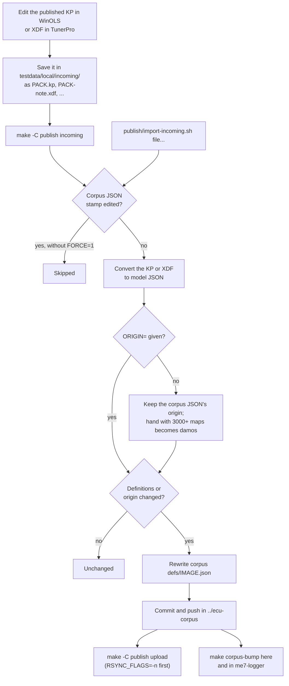

# Publishing map definitions

The published packs (KP, CSV map list, XDF with its metadata file, model JSON, tuner subsets of DAMOS packs, and dated zips) are generated from the model JSON in ecu-corpus `defs/IMAGE.json`. That JSON is the source of truth: a correction goes into it, never into the generated files. `make help` lists the targets and which packs are hand, full and tuner; outputs go to `build/publish/`, the published tree to `build/publish/stage/`.

## Workflow

- The corpus is `../ecu-corpus`, the full clone beside this repo, when it exists, else the read-only `corpus/` submodule; `CORPUS=` overrides it (docs/corpus.md).
- PACK is the pack's stem in `testdata/archive/ecuxplot/images.tsv`; the file name starts with it, followed by `.` or `-`.
- An XDF needs its metadata file to keep what XDF can't hold: `NAME.meta.json` next to it, else `build/publish/PACK.meta.json`, which matches the published XDF.
- `make incoming` runs `import-incoming.sh` on every KP and XDF in `incoming/`; the script also takes files as arguments. Files from `incoming/` (and their metadata files) move to `incoming/imported/`, so a later run can't import them over newer work. One file per pack per run.
- The comparison ignores the stamp and the rest of the provenance. The origin is `damos`, `a2l` or `hand` (docs/corpus.md); set `ORIGIN=damos` for a smaller DAMOS export, `DAMOS_MAPS=` changes the cutoff, `FORCE=1` imports over a hand-edited corpus JSON.
## Layout

`PACKS` in the Makefile lists the packs. Each is one of:

- Hand (origin `hand`): at the top level, `PACK.kp`, `.xdf`, `.meta.json`, `.csv`, `.json` and `PACK-DATE.zip` holding them.
- Full (origin `damos`, the known DAMOS packs): the same files in `full/`.
- Tuner: a full pack whose image is ME7 (corpus.tsv family) also gets, at the top level, `PACK-tuner.xdf`, `.meta.json`, `.csv` and `PACK-tuner-DATE.zip`: only the maps named in the corpus `categories.json` (`CATEGORIES=` overrides it; docs/corpus.md) and the objects their axes point at, filed under its categories. No tuner KP (untested in WinOLS) and no model JSON (a subset is not a definition). None are built when the table is missing. Non-ME7 DAMOS packs (8D0907558E, 8D0907558M) are in `full/` only.

`README.txt` explains the layout to downloaders and is published at the top level.

Inside a zip the files are renamed `STEM-DATE.EXT`, so an XDF and its metadata file keep one stem and xdfkit finds the metadata file next to the XDF. A zip is dated by the last commit of its pack's source (the corpus JSON, or the archived KP), and a tuner zip also by `categories.json`'s, whichever is later. Only the current zip is published: the date tells users the pack changed, and `make upload` (`rsync --delete` to `UPLOAD_DEST`, set in the gitignored `local.mk`) removes older ones and anything else not in the tree. A tuner XDF is marked as a subset (`provenance.subset`, docs/model.md), so `import-incoming.sh` refuses it, even renamed.

A pack without corpus JSON is converted from its archived KP in `testdata/archive/ecuxplot/`: 8N0906018CB, whose pack fits only the archive's non-OEM image; the Makefile gives it origin `damos` and family ME7.5. The archive is never edited, so that pack can't be corrected through `incoming` until an OEM image of its software is in the corpus.
